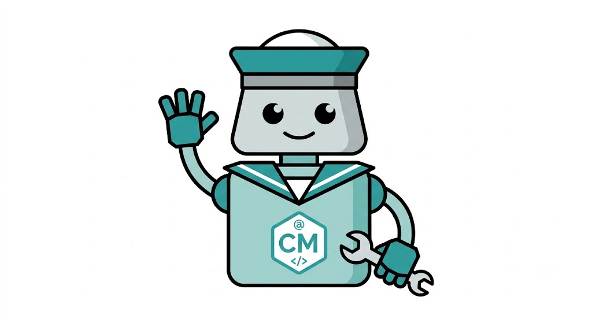

# crewmate



Watch GitHub PR comments (review and conversation) and issues for `@crewmate` mentions and reply with an explanation or a generated fix.

## Before you start

You need:

- [GitHub CLI](https://cli.github.com/) (`gh`) installed and authenticated.
- An LLM provider CLI in your PATH. The default is `claude` (Anthropic's CLI), but you can use any `claude`-shaped CLI (`--version`, `--model`, `-p`) via `--provider` or config. Wrap other tools in a shim if needed.
- A clean git working tree if you are watching a single PR.

## Caveats

- **Provider default is `claude`**. If you don't have `claude` installed, set a different provider in `crewmate init`, in your config, or with `--provider <command>`.
- **`--fix` works for single-PR review and conversation comments** that contain the tag `#fix`. It is disabled for repo or org scope, and issue bodies/comments cannot request fixes.
- **Crewmate adds an `eyes` reaction to each new `@crewmate` mention** and swaps it for a thumbs-up, thumbs-down, or rocket before posting the reply.
- **`--dry-run` still runs `gh pr checkout`** for single-PR targets. It skips posting replies and reactions and committing/pushing, but it may still touch your working tree.
- **Conversation comments and issue bodies/comments may be reprocessed** if the state file is lost, because GitHub does not expose a parent id for top-level conversation replies or issue body edits.
- **Repo and org scope use the GitHub search API**. Large scopes may hit rate limits; use a longer `--interval` for big organizations.

## Install

```bash
npm install -g crewmate
```

You can also install the `crewmate` skill from this repository:

```bash
npx skills add YogliB/crewmate --skill crewmate
```

If you are building from source, see [docs/CONTRIBUTING.md](docs/CONTRIBUTING.md).

## Usage

```bash
crewmate watch [<target>] [options]
crewmate stream [<target>] [options]
crewmate init
```

`<target>` is optional when `crewmate watch` or `crewmate stream` is run inside a git repository whose `origin` remote points to GitHub; it defaults to that repository. When provided, it can be:

- A single PR: `https://github.com/owner/repo/pull/4` or `owner/repo/pull/4`.
- A single issue: `https://github.com/owner/repo/issues/4` or `owner/repo/issues/4`.
- A repository: `https://github.com/owner/repo` or `owner/repo`.
- An organization: `https://github.com/orgs/myorg` or `org:myorg`.
- For GHES, use a full URL (`https://ghe.example.com/owner/repo`).

`crewmate init` is an interactive one-time setup that writes `provider`, `model`, `interval`, `user`, `prompt`, and `fix` defaults to `<config>/crewmate/config.json`.

### `crewmate watch`

- `--interval <seconds>` — seconds between polls. Default is `60`.
- `--fix` — try to generate, commit, and push a fix. The comment must also contain the tag `#fix`.
- `--model <model>` — use a specific model for explanations and fixes.
- `--provider <command>` — use a specific provider CLI instead of `claude`.
- `--prompt <text>` — prepend custom instructions to the LLM prompt.
- `--log` — mirror structured log lines to stderr as well as writing them to the log file.
- `--dry-run` — preview the reply, fix, and emoji reaction changes on stdout without posting to GitHub or committing/pushing. Polls continuously like regular watch mode.
- `--user <login>` — only reply to comments from this GitHub user (defaults to the active `gh` user when omitted and not set in config). Always respected.
- `--unsafe-no-user` — reply to comments from any GitHub user. Disables the default filter that falls back to the active `gh` user. This flag wins over `--user`.
- `--debug` — emit extra poll pipeline detail (`fetched-comments`, `mention-filter`, `new-mentions`) to the log.

`--fix` works for single-PR review and conversation comments. It is disabled for repo, org, or issue scope, and issue bodies/comments cannot request fixes.

### `crewmate stream`

Emit new `@crewmate` mentions as NDJSON to stdout without invoking a provider or posting replies. Use this to feed an agent or another pipeline.

- `--interval <seconds>` — seconds between polls. Default is `60`.
- `--log` — mirror structured log lines to stderr as well as writing them to the log file.
- `--user <login>` — only emit mentions from this GitHub user (defaults to the active `gh` user when omitted and not set in config). Always respected.
- `--unsafe-no-user` — emit mentions from any GitHub user. Disables the default filter that falls back to the active `gh` user. This flag wins over `--user`.
- `--debug` — emit extra poll pipeline detail (`fetched-comments`, `mention-filter`, `new-mentions`) to the log.

`crewmate stream` can run outside a git working tree and uses only the global config. The `<target>` can be a single PR, a repo, an org, or a GHES full URL. Each emitted line is a JSON object with `at`, `event`, `owner`, `repo`, `number`, `commentId`, `kind`, `user`, `body`, `url`, and `path`/`line` for review comments.

State (seen comment IDs) is stored in `<config>/crewmate/state.json` and logs in `<config>/crewmate/crewmate.log`, where `<config>` is `$XDG_CONFIG_HOME`, `$HOME/.config` (or `%USERPROFILE%/.config` on Windows), or the current working directory if none of those are set.
Structured logs are appended on a best-effort basis; the file is not rotated or truncated. Use `--log` to also mirror each log line to stderr.

## Configuration

Set defaults and per-repo overrides in two JSON files.

- Global config: `<config>/crewmate/config.json` — global `defaults` plus `profiles` keyed by `owner/repo`.
- Per-repo config: `.crewmate.json` in the repository root.

Precedence, strongest first:

1. CLI flags.
2. Per-repo `.crewmate.json` (when `crewmate watch` or `crewmate stream` is run on a single PR inside that repository's working tree).
3. Global config (defaults are merged first, then the matching `profiles["owner/repo"]` overrides any overlapping fields).

`repo` and `org` scope watches run outside the target repository and therefore use only the global config.

Both files use the same profile keys: `provider`, `model`, `interval`, `user`, `prompt`, `fix`, `dryRun`, `log`, and `debug`. Unknown keys are ignored. Invalid types for known keys are warned and ignored. In the global file, the `profiles` map keys (owner/repo) are matched case-insensitively. See `assets/config.schema.json` for the full schema; point your IDE at it for validation and autocomplete.

Example `.crewmate.json`:

```json
{
	"$schema": "https://raw.githubusercontent.com/YogliB/crewmate/main/assets/config.schema.json",
	"provider": "my-llm",
	"prompt": "Be terse"
}
```

Example global `config.json`:

```json
{
	"$schema": "https://raw.githubusercontent.com/YogliB/crewmate/main/assets/config.schema.json",
	"defaults": { "interval": 120 },
	"profiles": { "myorg/myrepo": { "provider": "my-llm" } }
}
```

## Log events

Each line in `crewmate.log` is an NDJSON object with an `at` ISO-8601 timestamp and an `event` field. Events include:

- `poll` — started a poll iteration.
- `mention` — found a new `@crewmate` mention.
- `reply` — posted or would post a comment reply (`kind: explain|fix|error|nochange`, `failed` on errors).
- `fix` — wrote or would write a file fix (`sha` when committed).
- `warning` — a recoverable problem such as an empty provider response or corrupted state file.
- `error` — an unhandled failure that stops the watch loop (`errorType`, `message`, `stack`).
- `info` — a notice such as dry-run mode.
- `debug` — diagnostic detail about the poll pipeline (`stage: fetched-comments|mention-filter|new-mentions`), useful for figuring out why a mention was or wasn't picked up.

Additional fields vary by event (e.g., `owner`, `repo`, `number`, `commentId`, `url`, `path`).

## Example

```bash
crewmate watch owner/repo/pull/4
crewmate watch owner/repo/pull/4 --fix --user myorg-bot
```

## Notes

- Each poll processes every new unseen `@crewmate` mention; additional polls handle comments added after the current poll.
- If a fix is committed but `git push` fails, the commit stays local. Push it yourself once the problem is fixed.

## TBD

- **Degit integration**: keep a fast, minimal copy of the target repo in the CLI config folder so agents have code context without a full clone.
- **Init-time model selection**: when running `crewmate init`, query the configured provider for its available models and let the user select one.
- **Sandboxed agents by default**: agents run in a sandbox by default.
- **Add `--once` / `--iterations` flag for `watch` and `stream`**: so the CLI can stop after a single poll (or N polls) instead of running forever. Useful for CI and manual testing.
- **Document the `--dry-run` state caveat** (docs-only change, not a code change): clarify in the README/help that `--dry-run` does not persist state and therefore reprocesses all existing `@crewmate` mentions on every poll.
- **Move `stream` warnings to stderr**: keep stdout strictly NDJSON so downstream pipelines do not break on `Warning: Search failed...` lines.
- **Fix `stream` unsupported-flag warning ordering**: warn about unsupported flags like `--fix` / `--dry-run` / `--provider` before trying to resolve the default target, so the warning is visible even when run outside a git repo without an explicit target.
- **Extend `crewmateReplied` deduplication to conversation and issue comments**: today only review-comment replies suppress the original mention; top-level conversation/issue replies can be reprocessed if the state file is lost.
- **Improve single-PR `watch` not-found messaging**: a non-existent PR currently surfaces as a raw `gh api` 404 inside a `poll failed` warning; a cleaner "PR not found" message would help.

## More docs

- [Contributing](docs/CONTRIBUTING.md) — build, test, and submit changes.
- [Troubleshooting](docs/TROUBLESHOOTING.md) — common runtime issues.
- [Security](docs/SECURITY.md) — how to report vulnerabilities.
- [Changelog](docs/CHANGELOG.md) — what changed.
- [Architecture](docs/ARCHITECTURE.md) — how the code is organized.
- [AGENTS.md](AGENTS.md) — setup and commands for coding agents.

## License

[MIT](LICENSE.md)
