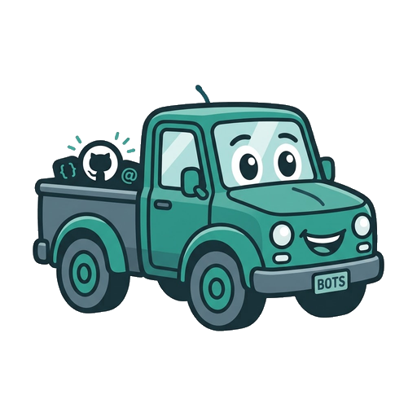

# pickup

[](https://yoglib.github.io/pickup/)

A CLI that watches GitHub PR review comments for `@pickup` mentions and replies with explanations or generated fixes.

## Usage

```bash
pickup watch <pr-url-or-shorthand> [--interval <seconds>] [--fix] [--user <login>]
```

`<pr-url-or-shorthand>` can be a full URL (`https://github.com/owner/repo/pull/4`) or a shorthand (`owner/repo/pull/4`).

- `--interval`: seconds between polls (default 60).
- `--fix`: attempt to apply a generated fix and push a commit. The review comment body must also contain the word `fix` (case-insensitive).
- `--user`: only respond to comments from this GitHub login.

State (seen comment IDs) is persisted in `$XDG_CONFIG_HOME/pickup/state.json`.

## Caveats

- Each poll processes the newest unseen `@pickup` mention; additional mentions are handled in subsequent polls.
- Run from a clean repository; `gh pr checkout` will fail if the working tree has uncommitted changes.
- If `git push` fails after a fix is committed, the commit remains local and must be pushed manually.

See [docs/CONTRIBUTING.md](docs/CONTRIBUTING.md) for how to contribute. [docs/SECURITY.md](docs/SECURITY.md) explains how to report vulnerabilities. [docs/TROUBLESHOOTING.md](docs/TROUBLESHOOTING.md) covers common build/lint/format problems. [AGENTS.md](AGENTS.md) summarizes setup and commands for tooling and coding agents.

## License

[MIT](LICENSE.md)
